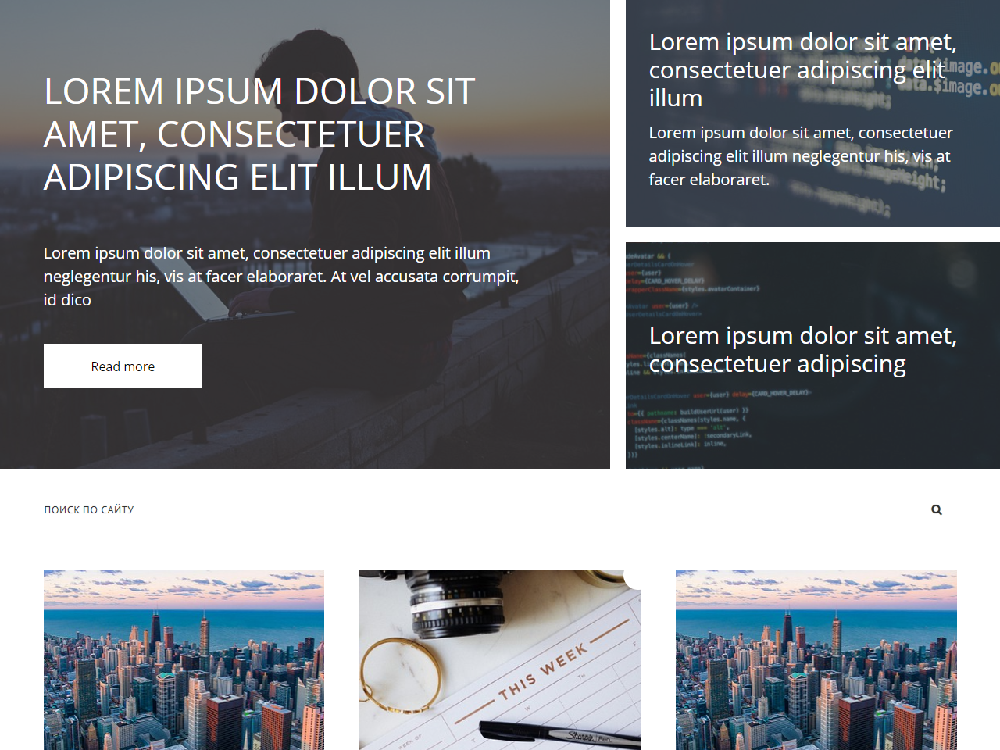

# Test page - flex layout

#### Установка
1. Установить [Node.js](https://nodejs.org/en/download/).
2. Скачать или клонировать этот репозиторий.
3. Запустить `start.bat` из корня проекта. При первом запуске будет произведена установка необходимых модулей - дождитесь окончания процесса.

    3.1. Для ОС, отличающихся от Windows: вместо `start.bat` перейти через командную строку в папку проекта и вызвать `npm run build` (для установки).
    
4. Открыть файл `public/index.html`.

